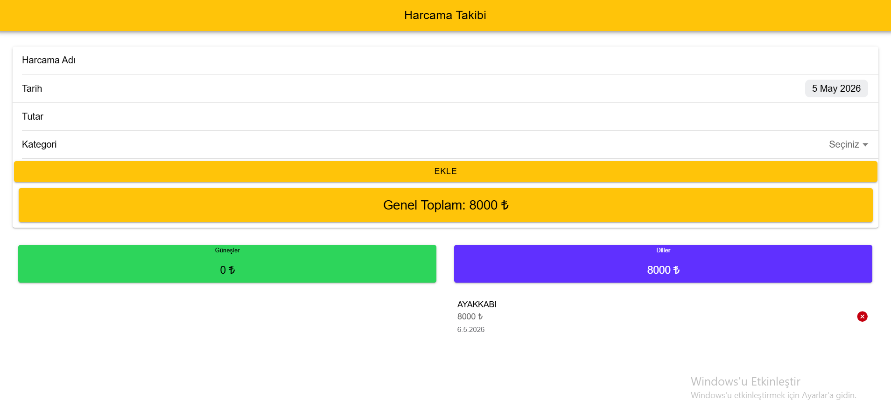
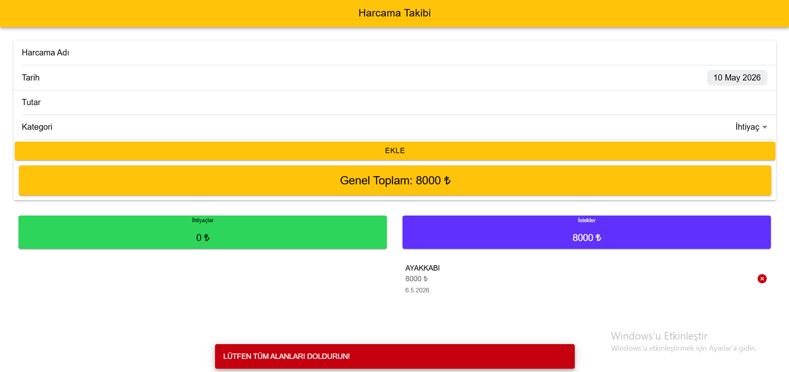
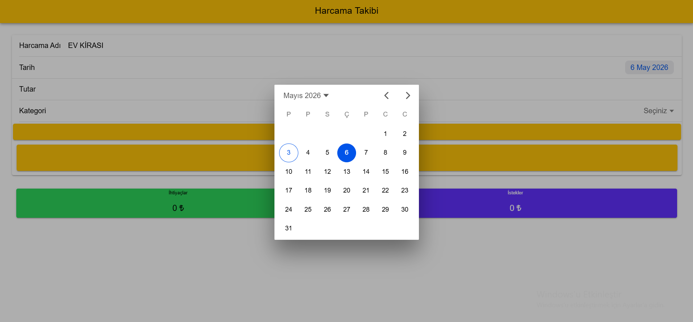
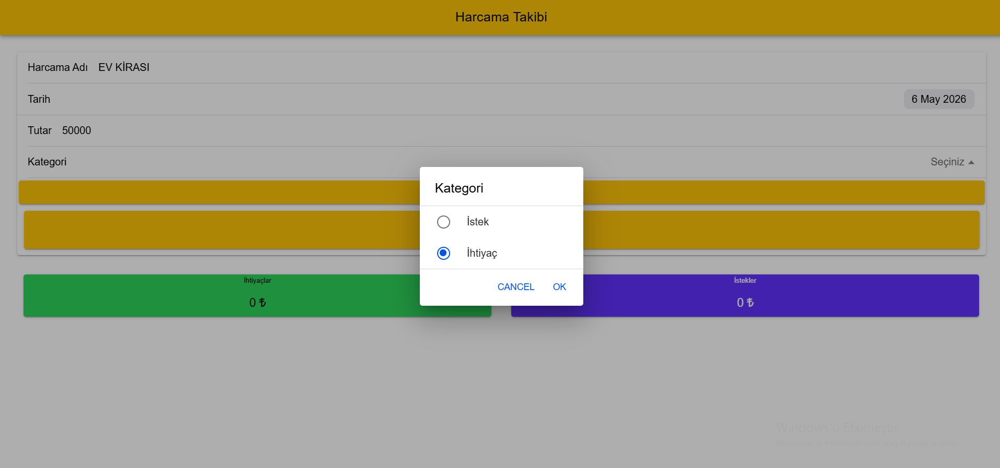
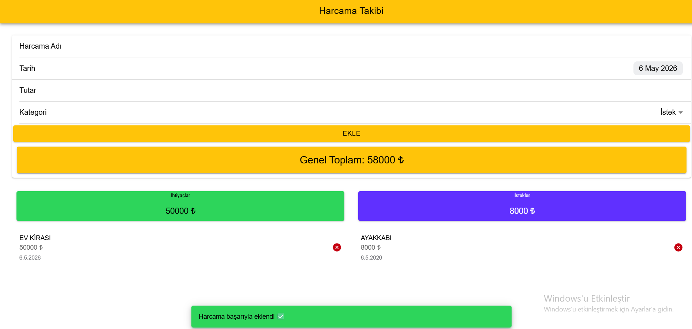
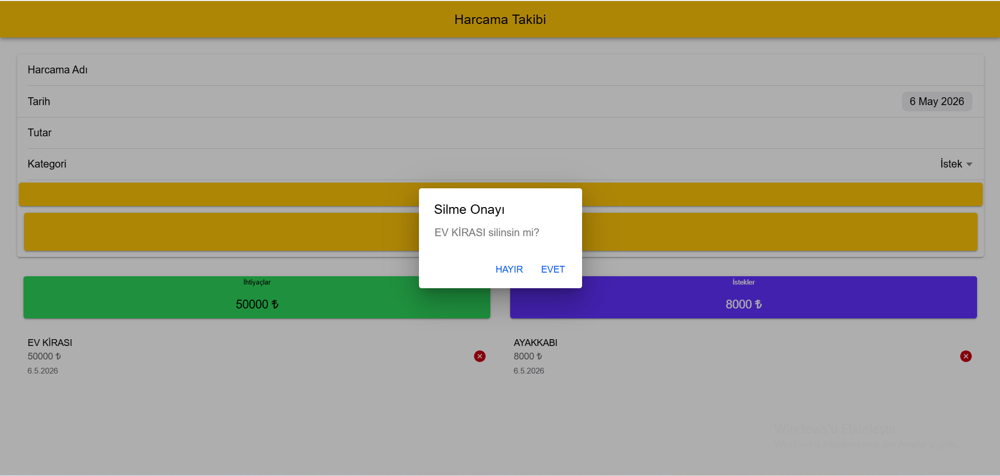
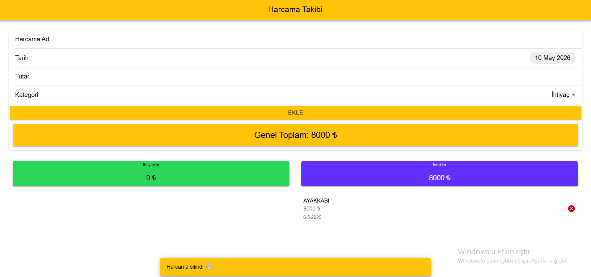

# 📱 Günlük Harcama Takip Uygulaması

## 🎯 Proje Amacı

Bu projenin amacı, Ionic Framework ve Angular kullanarak kullanıcıların günlük harcamalarını takip edebileceği basit ve kullanışlı bir mobil uygulama geliştirmektir.

Kullanıcılar harcamalarını **İhtiyaç** ve **İstek** olarak ayırarak daha bilinçli bir şekilde analiz edebilir.

---

## ⚙️ Kullanılan Teknolojiler

* Ionic Framework
* Angular
* TypeScript
* HTML / SCSS
* LocalStorage (veri saklama)

---

## 📌 Uygulama Özellikleri

### ➕ Harcama Ekleme

* Kullanıcı:

  * Harcama adı
  * Tutar
  * Tarih
  * Kategori (İhtiyaç / İstek)
    girerek kayıt ekleyebilir.

---

### 📅 Tarih Seçimi

* Kullanıcı harcama tarihini seçebilir
* Tarih verisi formatlanarak gösterilir

---

### 📊 Kategoriye Göre Ayırma

* Harcamalar iki gruba ayrılır:

  * 🟢 İhtiyaç
  * 🔵 İstek

---

### 💰 Toplam Hesaplama

* İhtiyaç toplamı
* İstek toplamı
* Genel toplam

dinamik olarak hesaplanır ve ekranda gösterilir.

---

### ❌ Harcama Silme

* Kullanıcı harcamayı silebilir
* Silmeden önce onay alınır

---

### 🔔 Bildirimler

* Başarılı işlem sonrası Toast mesajı gösterilir
* Hatalı girişlerde uyarı verilir

---
### EKRAN GÖRÜNTÜLERİ


##Kullanıcı bu ekranda harcama adı, tarih, tutar ve kategori bilgilerini girerek yeni harcama ekleyebilir.




##Eksik bilgi girildiğinde kullanıcıya uyarı mesajı gösterilir.




##Kullanıcı harcama tarihini takvim üzerinden seçebilir.




##Kullanıcı harcamayı “İstek” veya “İhtiyaç” olarak kategorize edebilir.





##Harcama eklendiğinde kullanıcıya kısa süreli bir bilgilendirme mesajı (Toast) gösterilir




##Harcama silinmeden önce kullanıcıdan onay alınır.





##Harcama eksildiğinde kullanıcıya kısa süreli bir bilgilendirme mesajı (Toast) gösterilir


### 💾 Veri Saklama

* Tüm veriler **LocalStorage** kullanılarak saklanır
* Sayfa yenilense bile veriler kaybolmaz

---

## 🧠 Uygulama Mantığı

1. Kullanıcı veri girer
2. Veriler diziye eklenir
3. LocalStorage’a kaydedilir
4. Uygulama açıldığında tekrar yüklenir
5. Toplamlar otomatik hesaplanır

---

## 📂 Veri Yapısı

Veriler LocalStorage içinde şu şekilde tutulur:

```json
{
  "istekler": [],
  "ihtiyaclar": []
}
```

---

## 🚀 Çalıştırma

```bash
npm install
ionic serve
```

---

## 💬 Sonuç

Bu uygulama ile kullanıcılar harcamalarını kategorize ederek:

* daha bilinçli harcama yapabilir
* ihtiyaç ve isteklerini analiz edebilir

---

## 🎓 Not

Bu proje, mobil uygulama geliştirme, veri yönetimi ve kullanıcı etkileşimlerini öğrenmek amacıyla geliştirilmiştir.